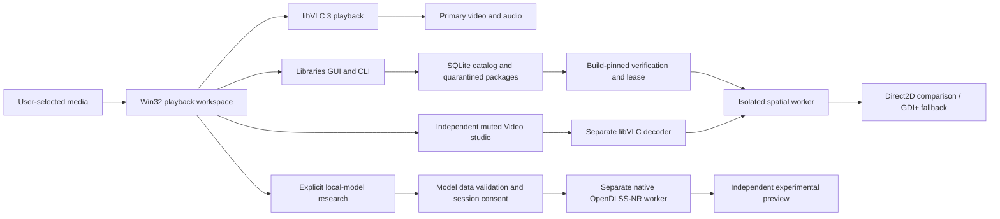
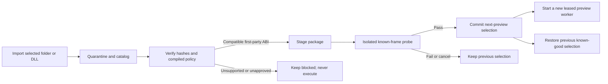

<div align="center">

# Shiny Player

### A local-first Windows workspace for watching, reviewing and comparing video.

[](https://github.com/Alex-Unnippillil/shiny-engine/actions/workflows/vlc-player.yml)
[](https://github.com/Alex-Unnippillil/shiny-engine/actions/workflows/library-audit.yml)
[](https://github.com/Alex-Unnippillil/shiny-engine/actions/workflows/web.yml)

**[Windows installer](https://github.com/Alex-Unnippillil/shiny-engine/releases/download/v0.10.0/ShinyPlayer-0.10.0-Windows-x64-Setup.exe)** · **[Portable ZIP](https://github.com/Alex-Unnippillil/shiny-engine/releases/download/v0.10.0/ShinyPlayer-0.10.0-Windows-x64-Portable.zip)** · [Release & checksums](https://github.com/Alex-Unnippillil/shiny-engine/releases/tag/v0.10.0)

[Quick start](#quick-start) · [Workspace](#the-workspace) · [Architecture](#architecture) · [Tech stack](#tech-stack) · [Build](#build-and-test) · [Limits](#capabilities-and-limits)

</div>

> **0.10.0 · unsigned Windows x64 prerelease.** Real libVLC playback, local package management and conventional spatial comparisons are implemented. NVIDIA DLSS activation, trained-model quality, physical-GPU speed, HDR and neural audio synchronization are **not certified**. No NVIDIA DLLs or model weights are bundled. Shiny is independent of VideoLAN and NVIDIA.


*Actual Windows application capture from the release test run. The moving color pattern is our generated decoding fixture—not photographic enhancement evidence or a mockup.*

## The workspace

**Watch.** Open or drop local files, or deliberately enter a supported stream URL. The main player keeps audio, video, track selection and playback controls together. Its welcome screen explains runtime setup; media-dependent actions become available only when their prerequisites exist.

**Review.** Filter queue titles without searching private paths or stream URLs. Queue cards distinguish the current source from the highlighted item. Use the separate Adjustments view for live VLC filters; use bookmarks, chapters, frame stepping, A–B loops and snapshots for clip review.

**Explore.** Press **Ctrl+K** for a searchable list of existing actions. Open Video studio for a separate, muted source/output comparison, Libraries for verified package selection, or Neural research for explicitly authorized local-model experiments. None replaces primary playback automatically.

<table>
<tr>
<td width="50%"><br><strong>A clear starting point</strong><br>Open local media, choose an explicit stream, or locate VLC.</td>
<td width="50%"><br><strong>Find the next action</strong><br>Search commands; inspect prerequisites; explicitly run or cancel.</td>
</tr>
<tr>
<td><br><strong>Compare the same frame</strong><br>Side-by-side, wipe, output-only, source-only and 1:1 inspection.</td>
<td><br><strong>Know what will execute</strong><br>Quarantine, verify, stage, select next preview, and roll back.</td>
</tr>
</table>

All gallery images come from native Windows tests and are versioned with the release. Dark/high-contrast-aware colors, DPI-aware spacing and native keyboard semantics are shared across the main workspace, quick actions, Libraries and Video studio. This is not a claim of completed assistive-technology certification.

## Quick start

1. Install the Windows package, or extract the **entire** portable ZIP. Do not mix the player, workers and libraries from different builds.
2. Use an existing official **64-bit VLC 3.0.24+ in the 3.0 series**, or choose the optional verified VLC download in setup. For a nonstandard install, use **Media → Locate installed VLC**. VLC 4 is a different ABI and is not supported.
3. Open `ShinyVlcPlayer.exe`, then open or drop a local file. **Ctrl+K** opens Quick actions; **F1** shows keyboard help.

Setup is per-user, with shortcuts and uninstall. It does not modify your system VLC, install an elevated service or create a startup task. The optional VideoLAN archive is fetched only when selected and checked against a pinned SHA-256. For offline setup, provide the exact supported archive:

```powershell
.\ShinyPlayer-0.10.0-Windows-x64-Setup.exe /TASKS=vlcruntime /VLCARCHIVE="C:\Downloads\vlc-3.0.24-win64.zip"
```

The executable and setup are **unsigned**. Verify the release checksums and follow your organization's execution policy; no protection bypass is required or recommended. Native macOS/Linux installers are not provided.

### Compare the bundled spatial filters

Open **Libraries → Import bundled**, choose a version, then **Verify → Stage → Select next preview**. Open a seekable local video and use **Video studio → Start selected version**. All three first-party packages are conventional CPU filters; **Adaptive detail 1.2.0** adds noise gating and bounded, brightness-driven detail correction with edge-halo and transparency safeguards.

The studio is an independent, muted SDR preview, up to 960 pixels on its longest edge and 518,400 pixels total. Its Direct2D presenter can fall back to GDI+; Direct2D availability does not guarantee physical GPU acceleration. Reported latency measures worker round trips, not GPU execution. Choose another version and restart the preview to apply it. **Use original** clears the next-preview selection; close a running preview to stop its worker immediately.

[Library-management guide](docs/library-manager-guide.md) · [Workspace guide](docs/workspace-guide.md) · [Implementation status](docs/implementation-status.md)

## Architecture

The primary player, managed spatial worker and research worker are separate responsibilities. The browser extension is optional; it does not install the Windows player or grant unrestricted native control.



### Package selection is a transaction—not a DLL copy



Package and model trust remain distinct. The manager rechecks bytes at stage and launch; the worker repeats validation. Running packages are leased, not hot-overwritten. Pending import/delete journals and transactional selection support restart recovery. User-editable metadata cannot approve a vendor library. See [library-management status](docs/library-manager-status.md) for the original plan's remaining gates.

## Tech stack

These are technologies actually used in the repository—not proposed migrations.

| Component | Technology | Responsibility / source |
|---|---|---|
| Windows desktop | **C++20, Win32, Common Controls, DWM** | Native windows, controls, keyboard routing, DPI and shared theme: `native/vlc-player`, `native/ui` |
| Playback | **VideoLAN libVLC 3**, dynamically loaded | Media demux/decode, tracks, clock and primary audio/video: `engine.cpp` |
| Comparison presentation | **Direct2D, GDI+** | Retained preview bitmaps and compatibility rendering; not a guarantee of GPU filtering |
| Spatial processing | **Original C++ CPU filters**, versioned DLL ABI | Three build-pinned first-party packages: `native/library-manager/backends` |
| Local catalog | **SQLite 3.53.4 / JSON1** | Strict manifests, catalog, history and transactional selection; Windows build pins official source and hash |
| Integrity / process control | **BCrypt SHA-256, WinVerifyTrust, Windows jobs and pipes** | Byte identity, read-only signature audit, bounded worker lifetime and protocol |
| Optional native neural research | **Pinned OpenDLSS-NR, Vulkan, volk, GLSL/SPIR-V and PTX** | Separate graph worker and model-data guards: `native/nr-worker`; authorized compatible data required |
| Browser workspaces | **TypeScript 5.8.3, ES modules, HTML/CSS, WebGPU** | Media Lab, gated Neural Lab and LookLock; no React/Electron runtime |
| Browser integration / capture | **Manifest V3, native messaging, C++/WinRT, D3D11/HLSL** | Optional browser and consented Windows-capture paths; not the primary VLC pipeline |
| Build / packaging | **CMake 3.24+, MSVC, Python 3, PowerShell, Inno Setup 6** | Native builds, pinned dependencies, portable ZIP and per-user setup |
| Validation | **CTest, Node.js 22+, Python unittest, Playwright 1.63.0, GitHub Actions** | Portable policy tests, browser integration, actual Windows UI/decoder/installer checks |

Exact native source revisions and archive hashes are recorded in [the Windows workflow](.github/workflows/vlc-player.yml), [build script](scripts/Build-Windows.ps1), [SQLite fetcher](scripts/fetch-library-deps.py), [package lock](package-lock.json) and component notices. No web framework or cloud service is required to run the native player.

## Capabilities and limits

| Path | Implemented behavior | Boundary |
|---|---|---|
| Primary playback | Files, explicit streams, queue, rate, tracks, subtitle files, equalizer, chapters, loops, bookmarks and snapshots | Module/input support depends on installed VLC; not full VLC interface parity |
| Live adjustments | VLC contrast, brightness, saturation and gamma | Conventional filters, not AI |
| Managed spatial studio | Three real first-party DLLs, verified selection/rollback and same-frame comparisons | Independent CPU-copy SDR preview; not main-audio-synchronized, HDR, temporal inference or a video export pipeline |
| Driver super resolution | Optional VLC D3D11 request on the next media open | Requested is not verified active; not managed by a DLSS DLL swap |
| Native neural research | Real pinned graph integration and strict user-model intake | No bundled weights, trained-model quality study, vendor parity or hardware-speed certification |
| Imported comparison | Playback of output processed elsewhere with source audio only | Best-effort dual-player synchronization, not frame-exact inference |
| Browser labs | Local spatial media, reviewed-only neural adapter and LookLock still-frame protection | No universal site support or protected-media bypass |

For disc menus, conversion, casting and other advanced VLC features not reproduced here, use **Media → Open full VLC interface**. This opens the separately installed original application and pauses Shiny playback to avoid duplicate audio.

### Authorized local-model research

Open a local video → **Neural research → Local research → Inspect model folder → acknowledge authorized use → Prepare model**. The pinned native 71-block format is required; arbitrary ONNX files, checkpoints and DLLs are not accepted. Validation and consent are bound to the inspected fingerprint. This is not legal verification, curated approval or evidence of correct output. Tone, structure, mix and explicit PNG/report exports remain experimental and separate from primary playback.

[Research-mode format and limits](docs/research-mode.md) · [Native neural data flow](docs/native-neural.md) · [Unchanged original research plan](docs/RESEARCH_AND_IMPLEMENTATION_PLAN.md)

## Keyboard and focus

| Context | Controls |
|---|---|
| Anywhere in the main workspace | **Ctrl+K** Quick actions; **Ctrl+O** open files; **Ctrl+N** explicit stream; **Ctrl+F** queue/filter view; **F1** help |
| Playback surface | **Space** play/pause; **S** stop; **E** frame step; **←/→** seek 5 s; **Shift+←/→** seek 30 s; **N/P** next/previous; **M** mute |
| Review / window | **B** bookmark; **J** go to time; **[ / ]** A–B loop; **C** Cinema; **F** fullscreen |
| Queue | Native arrow/type-ahead navigation; **Enter** plays the highlighted item; **Delete** removes that item. Filtering never changes queue order; clear the filter before reordering |
| Quick actions | Type to filter; **↑/↓** choose; **Enter** explicitly runs an available command; **Esc** cancels without stopping playback |
| Queue filter / escape | **Esc** first clears a nonempty filter. Otherwise it leaves fullscreen or stops primary playback |

Focused edits, sliders, combo boxes and queue controls keep their normal keys; hidden sidebar controls do not retain focus after compact resize or Cinema. Compact windows retain queue selection through **Playback → Choose queued item**; expand the window for filtering/adjustment panels. The menu's advanced playback shortcuts are not injected into a focused text field.


## Build and test

### Native Windows package

Install Visual Studio C++ tools and Windows SDK, CMake 3.24+, Python 3, Git and Inno Setup 6. Clone the repository and run:

```powershell
git clone --recurse-submodules https://github.com/Alex-Unnippillil/shiny-engine.git
cd shiny-engine
powershell -File scripts/Build-Windows.ps1
```

The script builds native workers, kernels, manager, player, portable ZIP and installer using pinned upstream source and archives. A player-only CMake build does not independently build the NR worker. GUI and CLI executables do not require Node.js, Python or .NET at runtime.

### Portable C++ checks

```sh
cmake -S native/vlc-player -B build/player-policy -DCMAKE_BUILD_TYPE=Release
cmake --build build/player-policy --parallel
ctest --test-dir build/player-policy --output-on-failure
```

On Linux, these are policy/layout/geometry/filter-index checks—not a Linux player. Library-manager portable tests additionally require SQLite 3.38+ and OpenSSL development packages.

### Browser workspaces

```sh
npm ci --ignore-scripts
npm run check
python -m pip install playwright==1.63.0
python -m playwright install --with-deps chromium
npm run test:browser
npm run dev
```

Open `http://127.0.0.1:4173`. Use `git submodule update --init -- third_party/opendlss-nr` for an existing checkout. Load the built unpacked extension from `dist/extension`, not the repository root. Browser Neural Lab remains reviewed-only.

## Verification and release integrity

Release publication requires the **exact current main revision** to pass `browser-build`, `windows-build`, `vlc-player` and both `library-audit` matrix jobs. It verifies the newest run identities, archive digest, build provenance, complete portable checksums and required UI/decoder/installer reports before publishing a draft. Existing published versions are never overwritten.

The 0.10 release adds workspace tests for idle onboarding, unavailable commands, dialog cancellation, filtered queue activation/removal, tab switching, explicit command execution and compact-focus recovery. Earlier real-worker, managed-renderer, model-intake, browser and install/playback/uninstall gates remain. The existence of tests is not execution evidence: inspect the exact release's reports and CI runs. Synthetic fixtures do not certify trained models, real-world perceptual quality, hardware acceleration, physical audio or long-session behavior.

[Release integrity](docs/release-integrity.md) · [Source and verification status](docs/implementation-status.md) · [0.10 release notes](docs/release-0.10.md)

## Troubleshooting and privacy

**No runtime:** use Media → Locate installed VLC or the optional verified installer prerequisite; confirm x64 and the supported VLC 3.0 series. **Studio disabled:** play a seekable local video and wait for decoded dimensions; network sources are not accepted by this studio. **Package blocked after upgrading:** import and verify the new build's bundled packages; do not copy workers between builds. **Blank filtered queue:** clear the search; current playback is not removed by filtering. **Unsupported enhancement:** retain ordinary playback rather than forcing an unverified backend.

No media uploads, telemetry, persistent viewing history or automatic model downloads are implemented. Explicit streams and network shares contact their chosen endpoints. Queue and bookmarks are in memory; the separate package catalog/history persists. Exported playlists contain paths/URLs and require confirmation. Default diagnostic reports omit media paths and URLs. Uninstall retains the separate user package store to avoid deleting imported data.

## Repository map and licenses

| Path | Purpose |
|---|---|
| `native/vlc-player`, `native/ui` | Playback workspace, Quick actions, studio and shared theme |
| `native/library-manager` | Catalog/quarantine, reference filters, audit, worker, GUI and CLI |
| `native/nr-worker` | Pinned graph integration and validated model-data intake |
| `apps/player` | Browser installation/research guide |
| `apps/viewer`, `apps/nr`, `apps/looklock` | Browser media and still-frame workspaces |
| `apps/extension`, `native/windows` | Optional browser integration and Windows companion |
| `docs`, `tests`, `installers/windows` | Guides, reproducible tests and Windows distribution |

Original integration code: **MIT**. libVLC, OpenDLSS-NR, volk, Vulkan and other component notices remain applicable; model/runtime rights are separate from source-code licenses. [Player notices](native/vlc-player/THIRD_PARTY_NOTICES.md) · [Manager notices](native/library-manager/THIRD_PARTY_NOTICES.md) · [License](LICENSE).
