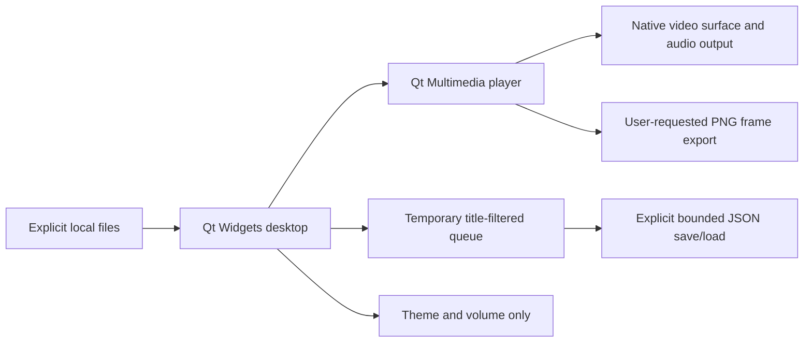

# Shiny Desktop 0.1.1 — cross-platform local-media edition

A C++20 / Qt Widgets desktop application for Windows, macOS and Ubuntu Linux. This is an **additive edition**, not a port of the Windows enhancement manager. It uses **Qt Multimedia**, not libVLC; the existing Windows Shiny Player retains its VLC tools, package store and research workflows unchanged.

## Downloads

[Windows Setup](https://github.com/Alex-Unnippillil/shiny-engine/releases/download/desktop-v0.1.1/ShinyDesktop-0.1.1-Windows-x64-Setup.exe) · [Windows Portable](https://github.com/Alex-Unnippillil/shiny-engine/releases/download/desktop-v0.1.1/ShinyDesktop-0.1.1-Windows-x64-Portable.zip) · [Apple Silicon DMG](https://github.com/Alex-Unnippillil/shiny-engine/releases/download/desktop-v0.1.1/ShinyDesktop-0.1.1-macOS-arm64.dmg) · [Intel Mac DMG](https://github.com/Alex-Unnippillil/shiny-engine/releases/download/desktop-v0.1.1/ShinyDesktop-0.1.1-macOS-x64.dmg) · [Ubuntu DEB](https://github.com/Alex-Unnippillil/shiny-engine/releases/download/desktop-v0.1.1/ShinyDesktop-0.1.1-Linux-x64.deb)

[Release, source, platform evidence and SHA-256 checksums](https://github.com/Alex-Unnippillil/shiny-engine/releases/tag/desktop-v0.1.1). The Windows libVLC edition's 0.10 release remains separate and unchanged.

## Optional external swapper on Windows

**Tools → Optional DLSS 5 Swapper (external)** opens a separate consent panel. Choose an installed/portable executable (not Setup), inspect its fingerprint, acknowledge third-party execution and launch once. Nothing is remembered or enabled by default. The integration rechecks bytes before launch, passes no media or target path and does not load its DLLs into Shiny. The other application runs independently with your account's permissions and is not sandboxed. No compatible DLSS video backend is added. macOS/Linux show a disabled Windows-only entry.

See [the optional swapper guide](../../docs/optional-swapper.md) for recognized filenames, cancellation, trust limits, official project sources and tests. That guide is also included beside the installed notices. The existing model and package authorization rules are not relaxed.

## Features

Open or drop local video/audio. Filter the temporary queue by title, remove the correct filtered item, navigate tracks, seek, change speed, repeat one/all, select embedded audio/subtitle tracks, toggle fullscreen and export a decoded frame as PNG. Save/open a strict version-1 local playlist explicitly. The dark theme can be disabled to use the native system palette. Menus, labels and controls retain native keyboard semantics and accessibility names.

Only volume and theme are persisted automatically. No account, telemetry, network player, automatic file history, unattended updater, shell endpoint, executable import or screen capture. Explicitly saved playlists contain absolute local paths and are not portable across machines unless those paths also exist. Lists are limited to 500 files / 1 MiB and imported transactionally. Missing files leave the previous queue intact. Mounted network storage can look like a local filesystem; this is not a same-user security sandbox.

## Installation targets

- **Windows x64:** per-user Setup EXE or complete Portable ZIP, with Qt/media runtime dependencies. Install alongside the existing Shiny Player; application IDs and preference stores are separate.
- **macOS 13+ Apple Silicon / Intel:** architecture-specific DMG; drag `ShinyDesktop.app` to Applications. Frameworks/plugins are bundled. Only an ad-hoc integrity signature is applied: **no Developer ID or notarization**. Follow OS/organization execution policy; no bypass instructions or security-disabling commands are needed here.
- **Ubuntu 24.04 x64:** `sudo apt install ./ShinyDesktop-0.1.1-Linux-x64.deb`. Apt resolves Qt and codec dependencies. The TGZ is a dependency-requiring archive, **not** an AppImage or universal Linux distribution. Remove with `sudo apt remove shiny-desktop`.

Uninstall removes application files, not user media or saved playlists. Preferences remain under the OS's standard `ShinyPlayer/ShinyDesktop` settings location. No system VLC, drivers, services, startup tasks or default associations are overwritten.

## Controls

Ctrl/Cmd+O opens files; Ctrl/Cmd+F focuses queue search; Ctrl/Cmd+. stops; F11 toggles fullscreen. With video focus, Space plays/pauses and Left/Right seek five seconds. With queue focus, Enter plays and Delete removes. Text input and slider keys are not hijacked. Media menu provides explicit playlist load/save. Snapshot exports the decoded frame, not subtitle overlays or a supposed neural result.

## Build

Windows/macOS CI pins Qt 6.11.2 (Qt Widgets, Multimedia, MultimediaWidgets, Test); Linux uses Ubuntu's maintained Qt development/runtime packages (minimum Qt 6.4). No Python, Node, .NET or separate Qt developer installation is required by the Windows/macOS packaged app. Python is a build/test tool only.

```sh
cmake -S native/desktop -B build/desktop -DCMAKE_BUILD_TYPE=Release -DCMAKE_PREFIX_PATH=/path/to/Qt
cmake --build build/desktop --config Release --parallel
ctest --test-dir build/desktop -C Release --output-on-failure
cmake --install build/desktop --config Release --prefix build/desktop-stage
```

The native-host `scripts/desktop_build.py` drives platform packaging and install/decode/remove tests in CI; Linux packaging requires apt permissions in a disposable test environment. The GUI's explicit `--smoke <fixture> <new-output-directory>` mode writes native playback evidence without preferences/history. It is not a simulated backend. CI exercises actual video delivery, pause, seek, decoded-frame PNG export, Stop and installed-package removal, separately from Qt policy/UI tests. Synthetic fixtures do not certify physical sound devices, GPU speed, every codec or photographic quality.

## Scope and release limits

This edition does **not** claim DLSS, neural inference, DLL swapping, VLC feature parity, HDR color fidelity, external subtitles, stream/capture support or enhancement export. The Windows libVLC edition remains the choice for its existing advanced features. Exact package signatures/notarization, broader Linux distributions, hardware/codec coverage, long sessions and assistive-technology qualification require further release testing. The initial distribution is a prerelease; use trusted local media and keep runtime dependencies updated.

Qt deployment documentation: https://doc.qt.io/qt-6/qt-generate-deploy-app-script.html
Qt Multimedia backend/deployment: https://doc.qt.io/qt-6/qtmultimedia-index.html

## Edition architecture



This app has no API for the existing Windows DLL/model workers. Keeping the editions separate preserves those authorization boundaries rather than silently dropping them during a port. Use trusted local media: protocol input restrictions are not a hostile-file or mounted-storage sandbox.
